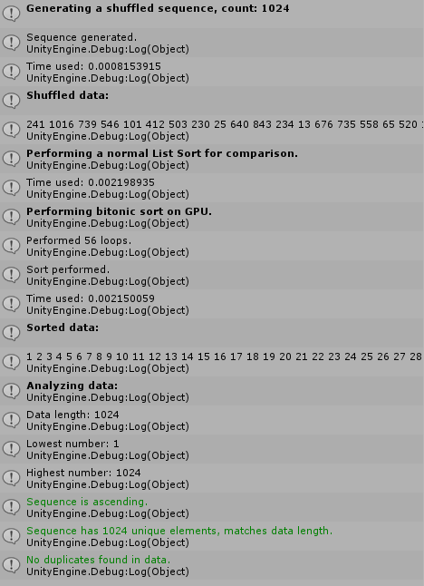

# BitonicSortGPU

## What is it?
This is my Bitonic sort implementation, with helper methods to test the validity of the results.

It can't process more than **2097152** values at the moment.

This is a test/prototype code, not a tool or anything intended for real use!

Sorting is done always for power of two values like 1024, 2048, 4096 and so on. Padding is added to enable sorting non-power of two sequences.

## Motivation
- I wanted to learn how the Bitonic sort actually works, and I also wanted to implement it on GPU (at least partially.)
- In this implementation the outer loop that does multiple dispatches is on the C# side.
- I wanted also write it as simple as possibe, so that it would be understandable later.
- So no bitwise operations etc. like in those very performant Microsoft examples...
- This was made purely for learning purposes, there's not much point in this otherwise (Except that I might try to implement the sort for certain shaders and effects.)

## Notes
- If you want to test the classic test sequence, just swap the comment with the shuffled number sequence generator.

-  Analysis helper method verifies the results so that the sorted sequence:
    - Has all the numbers of the range (such as 0-100.)
    - The numbers are in correct order.
    - No duplicate numbers.
    - No missing numbers.
    - Large number sequence will not print to debug as it will just freeze Unity.

## Code in action

© 2020 Olli Sorjonen All Rights Reserved
